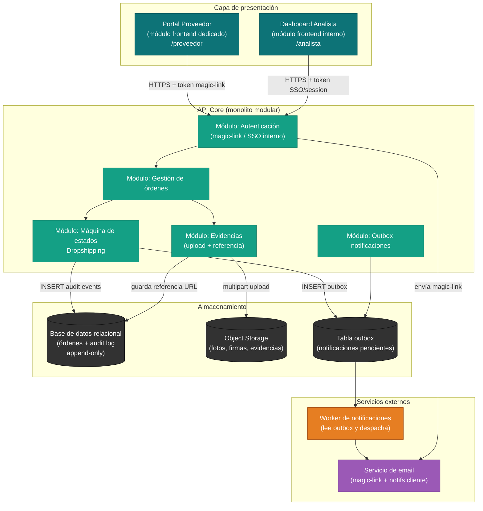
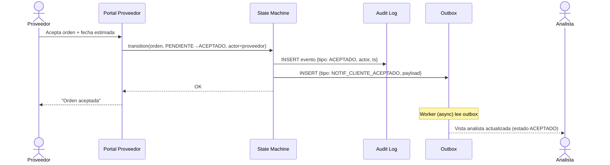
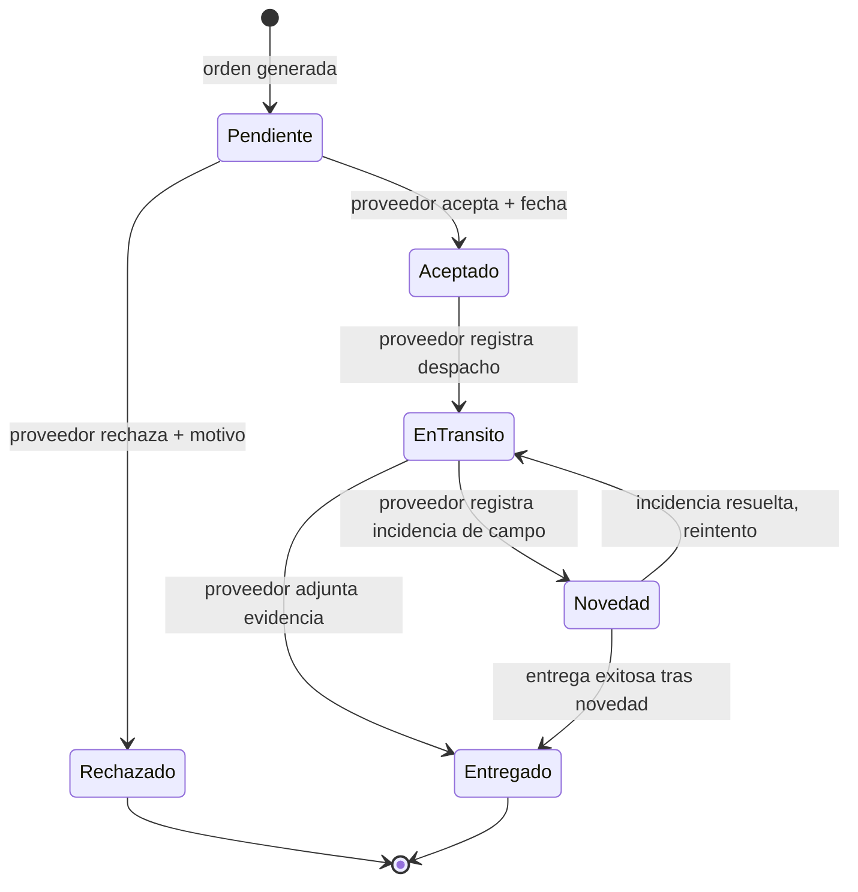

# Arquitectura — Dropshipping MVP

## Principio rector

El MVP prioriza **entregar valor al proveedor y al analista lo antes posible** con la menor complejidad operativa. Todas las decisiones estructurales se evalúan bajo la pregunta: *¿sostiene esto en el tiempo sin requerir un equipo de plataforma dedicado?* Las decisiones están registradas en los ADRs de esta carpeta.

---

## Diagrama de componentes

---

## Módulos del monolito y responsabilidades

| Módulo | Responsabilidad | ADR vinculado |
|--------|----------------|---------------|
| Máquina de estados | Válida transiciones permitidas, escribe eventos inmutables | ADR-0006, ADR-0002 |
| Gestión de órdenes | CRUD de órdenes, exposición de vista del analista | ADR-0001 |
| Autenticación | Magic-link para proveedor, SSO/session para internos | ADR-0004 |
| Evidencias | Recibe upload, guarda en object storage, retorna URL | ADR-0007 |
| Outbox notificaciones | Escribe en outbox dentro de la misma transacción de estado | ADR-0005 |

---

## Flujo principal: ciclo Dropshipping

---

## Estados del pedido Dropshipping (ADR-0006)

---

## Decisiones de arquitectura (ADRs)

| ADR | Decisión | Estado |
|-----|----------|--------|
| [ADR-0001](adr/ADR-0001-monolito-modular.md) | Monolito modular sobre microservicios | Aceptado |
| [ADR-0002](adr/ADR-0002-audit-log-append-only.md) | Audit log append-only para historial inmutable | Aceptado |
| [ADR-0003](adr/ADR-0003-portal-proveedor-modulo-frontend.md) | Portal proveedor como módulo frontend dedicado | Aceptado |
| [ADR-0004](adr/ADR-0004-autenticacion-magic-link.md) | Magic-link para autenticación del proveedor | Aceptado |
| [ADR-0005](adr/ADR-0005-notificaciones-outbox-transaccional.md) | Outbox transaccional para notificaciones al cliente | Aceptado |
| [ADR-0006](adr/ADR-0006-maquina-de-estados-explicita.md) | Máquina de estados explícita para pedidos Dropshipping | Aceptado |
| [ADR-0007](adr/ADR-0007-evidencias-object-storage.md) | Object storage para evidencias de entrega | Aceptado |

---

## Supuestos abiertos (open questions técnicas)

Estas decisiones no se tomaron en el MVP por falta de definición en el inbox. Son deudas técnicas que deben resolverse antes del sprint de E-03:

- **Canal de notificación al cliente** (email / SMS / push): no está definido en el inbox. El ADR-0005 asume email como mínimo viable; si se agrega SMS se requiere un provider adicional en el worker.
- **Proveedor de object storage**: se asume S3-compatible (AWS, MinIO, GCS). La elección concreta depende de la infraestructura existente de la empresa.
- **SSO interno**: se asume que existe un sistema de identidad corporativo. Si no existe, se necesitará un segundo ADR para autenticación interna.
- **Multi-proveedor por pedido** (R-09): explícitamente fuera del MVP canvas. La máquina de estados actual es 1:1 (pedido:proveedor). Soportar múltiples proveedores requeriría una revisión del ADR-0006.
