# Épicas — Dropshipping

## Resumen ejecutivo

El MVP busca dar trazabilidad estructurada al ciclo Dropshipping —desde que el proveedor acepta la orden hasta la entrega con evidencia— eliminando el seguimiento manual del analista y las consultas del cliente por desconocimiento. Los actores principales son el Proveedor (quien opera el portal), el Analista de Compras y Logística (quien necesita visibilidad sin perseguir), el Especialista de eCommerce (quien necesita reducir consultas entrantes) y el Cliente Final (quien necesita notificaciones en hitos clave). La métrica de éxito es que ≥ 70 % de los pedidos Dropshipping se completen sin que el analista realice ninguna consulta activa al proveedor durante el ciclo.

---

## Épicas priorizadas

### E-01 · Ciclo Dropshipping en portal del proveedor

**Valor:** Habilita al proveedor para operar los cuatro hitos del ciclo (aceptar, despachar, entregar, reportar novedad) desde un canal único, eliminando el correo como mecanismo principal y permitiendo que la información fluya automáticamente hacia el analista y el cliente. Sin esta épica, ninguna otra épica del MVP tiene datos para mostrar.

**Origen:**
- `mvp-canvas.md` → Funcionalidades mínimas: "Portal del proveedor: ver órdenes, aceptar/rechazar, registrar guía, marcar entregado con evidencia, registrar novedades"
- `mvp-canvas.md` → Riesgo #1: "si para cada pedido el proveedor llena demasiados campos, vuelve al correo" → el portal debe permitir ≤ 3 acciones por hito
- `user-stories.md` → US-01, US-02, US-03, US-04
- `requisitos.md` → R-01, R-02, R-03, R-05, R-06, R-07, R-08, R-30, R-32, R-33, R-34
- `personas.md` → Proveedor: dolores `pedido-incompleto-al-recibir`, `novedad-sin-registro-inmediato`, `stock-doble-canal`

**Historias candidatas:**
- HC-01 Como Proveedor, quiero ver mis órdenes asignadas con toda la información necesaria (producto, dirección, contacto, fecha esperada) y poder aceptarlas o rechazarlas con fecha estimada, para operar desde un solo canal sin depender del correo.
- HC-02 Como Proveedor, quiero registrar el despacho del pedido con guía de transporte o información alternativa (placa, conductor, fecha de salida), para que el tracking llegue al cliente sin intervención manual del analista.
- HC-03 Como Proveedor, quiero confirmar la entrega al cliente adjuntando evidencia (firma, foto o nombre del receptor), para cerrar el pedido de forma verificable y reducir reclamos por entregas no reconocidas.
- HC-04 Como Proveedor, quiero registrar una novedad de entrega desde el campo (cliente no disponible, dirección incorrecta, producto dañado) con foto u observación adjunta, para que todos los actores vean el mismo estado en tiempo real.
- HC-05 Como Sistema, debo bloquear la unidad de inventario del proveedor al confirmar el pedido, para impedir doble venta mientras el ciclo está activo.

**Criterios de épica completa:** El proveedor puede completar los cuatro hitos desde el portal en ≤ 3 acciones cada uno; todos los cambios de estado quedan en el historial con actor y timestamp; el inventario queda reservado al confirmarse el pedido.

---

### E-02 · Visibilidad operativa del analista

**Valor:** Le da al analista una vista centralizada del estado real de todos los pedidos Dropshipping activos, con alertas automáticas por inactividad y un historial inmutable de cambios. Elimina el modo "perseguir al proveedor por correo" como único mecanismo de seguimiento.

**Origen:**
- `mvp-canvas.md` → Funcionalidades mínimas: "Vista del analista: estado en tiempo real, alerta cuando un pedido no tiene update en el plazo configurado, historial inmutable"
- `mvp-canvas.md` → Outcome: "El analista deja de enviar correos o hacer llamadas para saber si el proveedor aceptó o despachó"
- `user-stories.md` → US-05, US-06
- `requisitos.md` → R-04, R-05, R-21, R-24, R-36
- `personas.md` → Analista: dolores `visibilidad-post-envio`, `confirmacion-proveedor-manual`, `tracking-disperso`, `evidencia-entrega-faltante`

**Historias candidatas:**
- HC-06 Como Analista, quiero ver el estado real de todos los pedidos Dropshipping activos en una sola vista (estado, proveedor, fecha prometida, días sin actualización), para detectar retrasos antes de que el cliente reclame.
- HC-07 Como Analista, quiero recibir una alerta automática cuando un pedido lleva más tiempo del configurado sin actualización del proveedor, para intervenir proactivamente.
- HC-08 Como Analista, quiero ver el historial completo de cambios de estado de cada pedido con actor y timestamp, para tener trazabilidad ante reclamos sin depender de correos.
- HC-09 Como Analista, quiero poder registrar manualmente actualizaciones de proveedores que operen por correo, para mantener la trazabilidad aunque el proveedor no use el portal.

**Criterios de épica completa:** El analista ve todos los pedidos activos con su estado actual; las alertas por inactividad se generan automáticamente; los registros manuales quedan marcados como tales en el historial; el historial es inmutable (append-only).

---

### E-03 · Notificaciones automáticas al cliente (Dropshipping)

**Valor:** Genera notificaciones proactivas al cliente en los hitos clave del pedido Dropshipping (aceptado, despachado, entregado, cambio de fecha, preaviso de contacto del proveedor), eliminando las consultas entrantes de "¿dónde está mi pedido?" sin intervención manual del equipo.

**Origen:**
- `mvp-canvas.md` → Funcionalidades mínimas: "Notificaciones automáticas: proveedor aceptó, pedido despachado, entregado, cambio de fecha"
- `mvp-canvas.md` → Outcome: "El cliente no tiene que llamar para preguntar el estado"
- `user-stories.md` → US-07, US-08, US-09
- `requisitos.md` → R-13, R-14, R-29, R-31
- `personas.md` → Especialista eCommerce: dolores `notificaciones-genericas`, `cambio-fecha-reactivo`; Cliente: dolores `proveedor-no-identificado`, `estado-pedido-no-granular`

**Historias candidatas:**
- HC-10 Como Especialista de eCommerce, quiero que el cliente reciba notificaciones automáticas en los hitos Dropshipping (aceptado, despachado, entregado) con el nombre del producto y el detalle del cambio, para reducir los contactos de "¿dónde está mi pedido?".
- HC-11 Como Especialista de eCommerce, quiero que el cliente reciba una notificación proactiva cuando cambia la fecha de entrega, explicando la fecha anterior y la nueva, para que no se entere al preguntar.
- HC-12 Como Cliente, quiero recibir un preaviso antes de que el proveedor me contacte para coordinar la entrega, para saber que la llamada es legítima y no una comunicación no deseada.

**Criterios de épica completa:** Los cuatro tipos de notificación (aceptado, despachado, entregado, cambio de fecha) se disparan automáticamente en el evento correspondiente; el cliente siempre recibe el nombre del producto afectado; no se envían notificaciones por movimientos internos intermedios.

---

### E-04 · Checkout diferenciado por modalidad de entrega

> **Nota:** El `mvp-canvas.md` clasifica esta épica como "fuera de alcance por ahora" por requerir cambios en la capa del eCommerce (proyecto paralelo con el equipo de frontend). Se incluye en el backlog para planificación futura, pero **no debe entrar en el sprint inicial**.

**Valor:** Le da al cliente visibilidad de la modalidad de entrega (Pickup / Delivery / Dropshipping) desde la ficha del producto y separa visualmente los grupos logísticos en el checkout, eliminando las expectativas falsas que generan reclamos post-compra.

**Origen:**
- `mvp-canvas.md` → Fuera de alcance: "Checkout diferenciado por modalidad: requiere cambios en la capa del eCommerce"
- `user-stories.md` → US-10, US-11, US-12, US-13
- `requisitos.md` → R-10, R-11, R-12, R-15, R-26, R-27, R-28
- `personas.md` → Especialista eCommerce: dolor `checkout-mixto-confuso`; Cliente: dolores `info-entrega-post-pago`, `confusion-confirmado-vs-listo`, `sin-opciones-stock-fallido`

**Historias candidatas:**
- HC-13 Como Especialista de eCommerce, quiero que la ficha de cada producto muestre su modalidad de entrega disponible y el tiempo estimado antes del checkout, para que las expectativas estén claras desde el inicio.
- HC-14 Como Especialista de eCommerce, quiero que el checkout separe visualmente los grupos logísticos y exija aceptación explícita del cliente cuando puede haber fechas de entrega distintas, para eliminar el reclamo de "pensé que todo llegaba junto".
- HC-15 Como Cliente, quiero que los mensajes "pedido confirmado" y "listo para retirar" sean explícitamente distintos, para no ir a la tienda antes de tiempo.
- HC-16 Como Cliente, quiero recibir opciones inmediatas cuando el stock Pickup prometido no esté disponible, para no quedarme sin solución ni tener que llamar.

**Criterios de épica completa:** La modalidad de entrega aparece en la ficha del producto; el checkout agrupa los productos por modalidad logística; el cliente acepta explícitamente las diferencias de fecha; los mensajes de confirmación y disponibilidad son distintos y explícitos.

---

### E-05 · Flujo Pickup en tienda

> **Nota:** El `mvp-canvas.md` clasifica esta épica como "fuera de alcance por ahora" por tener actores y flujo diferentes al Dropshipping. Se incluye en el backlog para el siguiente ciclo.

**Valor:** Digitaliza el flujo Pickup en sucursal: alertas dentro del sistema para el operador, visibilidad real del stock disponible, registro digital del retiro y reglas de vencimiento de reserva configurables. Elimina los registros en papel y los pedidos perdidos por correo no leído.

**Origen:**
- `mvp-canvas.md` → Fuera de alcance: "Flujo Pickup completo: opera con actores y flujo diferentes; se aborda en el siguiente ciclo"
- `user-stories.md` → US-14, US-15, US-16, US-17
- `requisitos.md` → R-16, R-17, R-18, R-19, R-20, R-22
- `personas.md` → Operador de Tienda: dolores `disponibilidad-stock-no-confiable`, `reserva-fisica-manual`, `sin-regla-no-retiro`, `notificacion-tienda-sin-alerta`, `trazabilidad-confirmacion-retiro`

**Historias candidatas:**
- HC-17 Como Operador de Tienda, quiero recibir una alerta dentro del sistema cuando se genera un pedido Pickup, con escalación automática al jefe de tienda si no se atiende en el tiempo configurado, para no perder ningún pedido por un correo no leído.
- HC-18 Como Operador de Tienda, quiero que el sistema muestre el estado real del stock para Pickup (libre, comprometido, en exhibición), para no confirmarle al cliente algo que no puedo cumplir.
- HC-19 Como Operador de Tienda, quiero registrar digitalmente quién retiró el producto con fecha, hora y opción de firma o foto, para tener trazabilidad ante cualquier reclamo sin buscar papeles.
- HC-20 Como Operador de Tienda, quiero que el sistema aplique una regla de vencimiento de reserva configurable, con recordatorio al cliente y liberación solo tras autorización, para no bloquear stock indefinidamente.

**Criterios de épica completa:** Los pedidos Pickup generan alertas en el sistema (no solo correo); el stock muestra estado real con reserva comprometida; el retiro queda registrado digitalmente con trazabilidad; las reservas vencen solo con autorización explícita.

---

## Diagrama del backlog

```mermaid
graph TD
  E01["E-01 · Ciclo Dropshipping\n(portal proveedor)"]
  E02["E-02 · Visibilidad analista"]
  E03["E-03 · Notificaciones cliente\n(Dropshipping)"]
  E04["E-04 · Checkout diferenciado\n⚠ post-MVP"]
  E05["E-05 · Flujo Pickup tienda\n⚠ siguiente ciclo"]

  E01 --> HC01["HC-01 Ver y aceptar/rechazar orden"]
  E01 --> HC02["HC-02 Registrar despacho con tracking"]
  E01 --> HC03["HC-03 Confirmar entrega con evidencia"]
  E01 --> HC04["HC-04 Registrar novedad de campo"]
  E01 --> HC05["HC-05 Reservar inventario al confirmar"]

  E02 --> HC06["HC-06 Vista global pedidos activos"]
  E02 --> HC07["HC-07 Alerta automática por inactividad"]
  E02 --> HC08["HC-08 Historial inmutable de cambios"]
  E02 --> HC09["HC-09 Registro manual por correo"]

  E03 --> HC10["HC-10 Notificaciones hitos Dropshipping"]
  E03 --> HC11["HC-11 Notificación cambio de fecha"]
  E03 --> HC12["HC-12 Preaviso contacto del proveedor"]

  E04 --> HC13["HC-13 Modalidad entrega en ficha"]
  E04 --> HC14["HC-14 Grupos logísticos en checkout"]
  E04 --> HC15["HC-15 Confirmado ≠ listo para retiro"]
  E04 --> HC16["HC-16 Opciones ante stock Pickup fallido"]

  E05 --> HC17["HC-17 Alerta pedido Pickup en sistema"]
  E05 --> HC18["HC-18 Estado real stock Pickup"]
  E05 --> HC19["HC-19 Registro digital retiro"]
  E05 --> HC20["HC-20 Vencimiento reserva configurable"]
```

