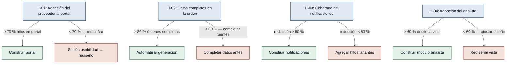
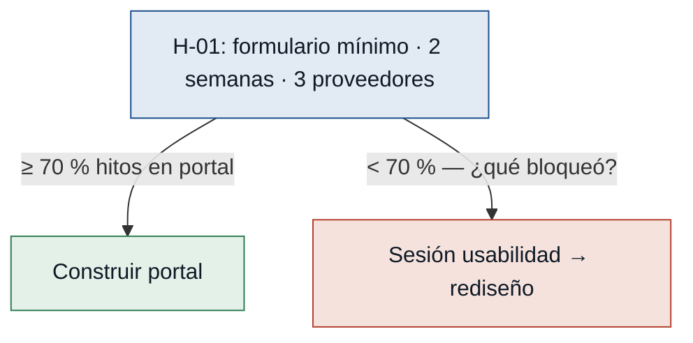
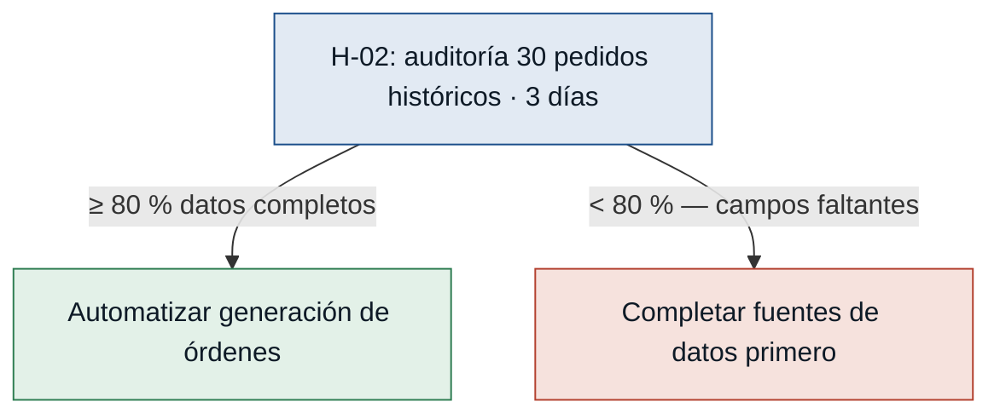
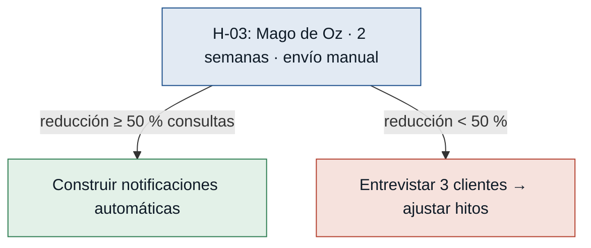
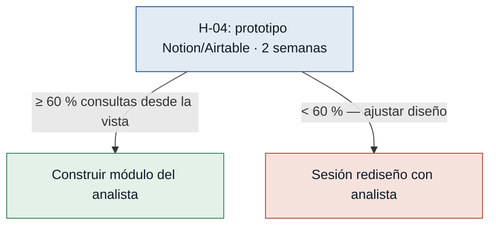

# Hipótesis y Experimentos — Dropshipping

Supuestos riesgosos del MVP Canvas ordenados de mayor a menor riesgo (impacto × incertidumbre).

---

## Árbol de decisión global

---

### [H-01] Adopción del proveedor al portal — riesgo: alto

- **Supuesto a probar:** Los proveedores usarán el portal como canal principal si el flujo por pedido requiere ≤ 3 acciones por hito y la orden llega con información completa. Sin adopción del proveedor, el MVP no entrega ningún valor.
- **Hipótesis:** Creemos que el proveedor completará los 4 hitos del ciclo Dropshipping (aceptar, despachar, entregar, novedad) a través del portal sin volver al correo, si el flujo de cada hito requiere ≤ 3 acciones y la información de la orden llega completa, porque el proveedor entrevistado advirtió explícitamente que vuelve al correo cuando hay demasiados campos. _(entrevista_proveedor.md)_
- **Señal medible:** % de hitos del ciclo Dropshipping registrados directamente por el proveedor en el portal, sin intervención manual del analista.
- **Criterio de éxito:** ≥ 70 % de los hitos registrados en el portal en 4 semanas de piloto con al menos 3 proveedores.
- **Experimento:** Concierge / Mago de Oz — crear un formulario mínimo (Google Forms o equivalente) que simule los 4 hitos del portal; invitar a 3 proveedores a usarlo durante 2 semanas con pedidos reales. El analista registra los resultados en el sistema actual. Medir hitos recibidos por formulario vs. por correo.
- **Caja de tiempo/costo:** 2 semanas de piloto + 3 días de análisis. Costo: 0 USD en herramientas, ~4 h del analista.
- **Regla de decisión:** Si pasa (≥ 70 %) → construir el portal priorizando la simplicidad validada. Si falla (< 70 %) → hacer sesión de usabilidad con los proveedores que no usaron el formulario, identificar qué los bloqueó y rediseñar el flujo antes de construir.

---

### [H-02] Información completa en la orden — riesgo: alto

- **Supuesto a probar:** Las órdenes que genera el sistema hoy ya contienen suficiente información para que el proveedor las procese sin consultas adicionales. Si no, la automatización solo acelerará el problema.
- **Hipótesis:** Creemos que el proveedor podrá aceptar y procesar el 80 % de las órdenes sin consulta previa, si la orden incluye los 8 campos de R-32 (código, descripción, cantidad, dirección completa, ciudad, contacto del cliente, fecha esperada y condiciones especiales), porque hoy el proveedor reporta que casi siempre tiene que preguntar algo antes de procesar. _(entrevista_proveedor.md)_
- **Señal medible:** % de los últimos 30 pedidos Dropshipping históricos que tenían los 8 campos de R-32 completos sin necesidad de consulta adicional al equipo interno.
- **Criterio de éxito:** ≥ 80 % de los 30 pedidos auditados tienen todos los campos completos.
- **Experimento:** Auditoría de datos históricos — el analista revisa los últimos 30 pedidos Dropshipping en el sistema actual y verifica cuántos tenían los 8 campos completos. Contrasta con registros de correos o llamadas donde el proveedor solicitó datos faltantes. No requiere construir nada.
- **Caja de tiempo/costo:** 3 días de análisis del analista. Costo: solo tiempo.
- **Regla de decisión:** Si pasa (≥ 80 % completos) → riesgo bajo; construir la automatización con confianza. Si falla (< 80 %) → identificar los campos que faltan más frecuentemente, definir la fuente de datos o el proceso para completarlos y resolverlos antes de automatizar la generación de órdenes.

---

### [H-03] Cobertura de las 4 notificaciones clave — riesgo: medio

- **Supuesto a probar:** Los 4 hitos de notificación (aceptado, despachado, entregado, cambio de fecha) cubren la mayoría de las consultas que los clientes hacen sobre el estado de sus pedidos Dropshipping.
- **Hipótesis:** Creemos que el volumen de consultas de clientes sobre estado de pedidos Dropshipping disminuirá en al menos 50 %, si el cliente recibe notificaciones en los 4 hitos clave, porque el cliente entrevistado llamó exactamente para preguntar esos estados y dijo no necesitar mensajes por movimientos internos. _(cliente.md)_
- **Señal medible:** Número de contactos entrantes al área de servicio al cliente sobre estado de pedidos Dropshipping por semana.
- **Criterio de éxito:** Reducción de al menos 50 % en contactos por semana en las 2 semanas del experimento vs. las 2 semanas previas.
- **Experimento:** Mago de Oz — durante 2 semanas, el especialista de eCommerce envía manualmente los 4 tipos de notificación (por WhatsApp o email) a los clientes de pedidos Dropshipping en curso en el momento exacto de cada hito. Medir contactos entrantes esas 2 semanas vs. las 2 anteriores.
- **Caja de tiempo/costo:** 2 semanas + ~30 min/día del especialista. Costo: solo tiempo.
- **Regla de decisión:** Si pasa (reducción ≥ 50 %) → las 4 notificaciones son suficientes; construir el sistema automático. Si falla (reducción < 50 %) → entrevistar a 3 clientes que igual llamaron para identificar qué información adicional necesitaban e incorporarla antes de construir.

---

### [H-04] Adopción del analista a la vista unificada — riesgo: medio

- **Supuesto a probar:** El analista adoptará la vista unificada del portal como fuente principal de estado de pedidos si consolida en un solo lugar toda la información que hoy busca en múltiples fuentes.
- **Hipótesis:** Creemos que el analista resolverá al menos el 60 % de sus consultas de estado de pedidos Dropshipping desde la vista unificada sin consultar correo ni llamar al proveedor directamente, si la vista muestra estado actual, proveedor asignado, fecha prometida, días sin update y alerta de inactividad por pedido, porque el analista describió el tiempo que pierde revisando varias fuentes para saber el estado real de un pedido. _(analista_de_compras_y_logistica.md)_
- **Señal medible:** % de consultas de estado de pedidos Dropshipping que el analista resuelve desde la vista unificada sin recurrir a correo ni llamada directa al proveedor.
- **Criterio de éxito:** ≥ 60 % de consultas resueltas desde la vista en las 2 primeras semanas de piloto.
- **Experimento:** Prototipo navegable (solo lectura) — configurar una hoja de cálculo compartida o tablero en Notion/Airtable actualizado manualmente durante 2 semanas, simulando la vista unificada. El analista registra en una bitácora de 5 min/día si consultó el tablero o fue directo al correo/proveedor.
- **Caja de tiempo/costo:** 3 días de configuración + 2 semanas de piloto. Costo: herramientas gratuitas + tiempo del analista.
- **Regla de decisión:** Si pasa (≥ 60 %) → el analista adoptará la vista; construir el módulo. Si falla (< 60 %) → sesión de 1 hora con el analista para entender qué información le falta en la vista y ajustar el diseño antes de construir.

